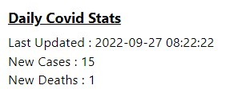

# Daily Covid SL



This is a simple chrome extension that displays the new covid cases & new deaths (in Sri Lanka) on the previous day.

#### How to install

1.Clone the repo and install.

    To clone
    ```
    git clone https://github.com/pasindumarasinghe/daily-covid-sl
    ```
    
    To install

    ```
    cd daily-covid-sl
    npm ci
    ```

2.Open Chrome.
3.Type `chrome://extensions/` in the address bar.
4.Click on  **Load Unpacked** and select the **daily-covid-sl/dist** directory as the extension directory.
